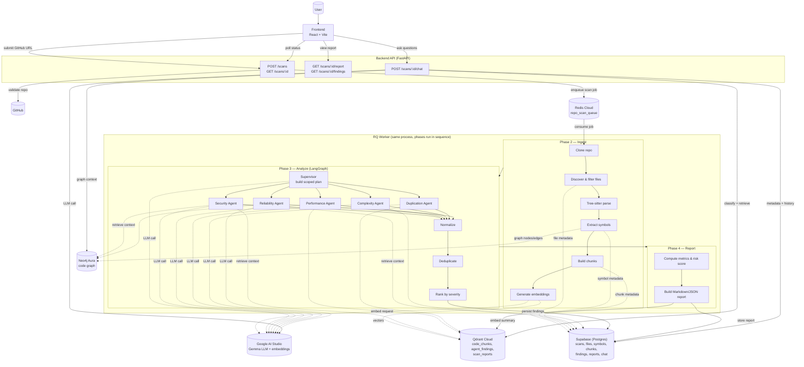

# Code Quality Intelligence Analyst

## Overview

Code Quality Intelligence Analyst takes a public GitHub repository URL and turns it into a deep, actionable code-quality report. It clones and parses the codebase, builds a semantic and structural index of it, runs five specialized AI agents over it to find security, performance, complexity, duplication, and reliability issues, and produces a ranked report you can explore — including a RAG chatbot that answers questions about the scanned repo, grounded in its own code and findings.

<!--
## Demo Video

> _Demo video link goes here._
-->

## Features

- **Scan any public GitHub repo** by pasting its URL — no setup on the target repo required.
- **Automatic repo validation** — existence, visibility, size limit, and branch checks before a scan is accepted.
- **Deep code parsing** with Tree-sitter across Python, JavaScript, TypeScript, JSX, and TSX.
- **Structural code graph** (Neo4j) capturing files, symbols, imports, and call relationships.
- **Semantic code search** (Qdrant) over every function/class/file chunk in the repo.
- **Five specialized AI agents** — Security, Performance, Complexity, Duplication, and Reliability — each scoped to the parts of the repo relevant to it.
- **Ranked, deduplicated findings** with severity, confidence, evidence, and a concrete fix recommendation for each issue.
- **Auto-generated report** (Markdown + JSON) with an overall risk score and per-file/per-agent breakdowns.
- **RAG chatbot** for the scanned repo — ask about specific files, findings, or fix priorities and get answers grounded in real retrieved context.
- **Live scan progress** — inline status polling from "queued" through "reported," no page reload required.

## Architecture

## Tech Stack

| Layer | Technology |
|---|---|
| Backend framework | Python 3.11, FastAPI |
| Backend package manager | uv |
| Background jobs | RQ on Redis Cloud |
| Relational storage | Supabase (Postgres) |
| Vector storage | Qdrant Cloud |
| Graph storage | Neo4j Aura |
| Code parsing | Tree-sitter (`tree-sitter-language-pack`) |
| Agent orchestration | LangGraph |
| LLM & embeddings | Google AI Studio (Gemma models + Gemini Embedding) |
| Frontend framework | React + TypeScript, Vite |
| Frontend styling | Tailwind CSS, shadcn/ui |
| Task orchestration | Task (`Taskfile.yml`) |

## Challenges and Solutions

| Challenge | Problem | Solution | Impact |
|---|---|---|---|
| LLM provider churn | Paid DeepSeek key ran out of credits mid-scan (live `402`); free-tier models then hit frequent `429`s under concurrent load | Moved to Google AI Studio (Gemma), added a 4-tier key + model fallback cascade with backoff per agent | Scans complete reliably on a free-tier LLM without a billing dependency |
| Windows async concurrency crash | All 5 agents firing concurrently crashed with `WinError 10035` — Windows' `ProactorEventLoop` choking on simultaneous overlapped I/O | Capped agent-turn concurrency to 2 via a semaphore wrapping each agent's full turn, not just the LLM call | Local development on Windows became stable without changing production (Linux) behavior |
| Cross-event-loop semaphore crash | A module-level semaphore bound to the first event loop crashed every scan after the first one on a long-lived worker process | Rebuild the semaphore fresh at the start of every analysis run | Worker survives processing many scans back-to-back, matching real deployment usage |
| Gemma "thinking" output parsing | Gemma's reasoning-trace response part was mistaken for the actual answer, breaking JSON parsing | Filter out any response part marked `thought: true` before extracting the answer | Agents reliably return valid structured findings regardless of thinking-mode output |
| Embedding dimension mismatch | Switching embedding models defaulted to 3072-dim vectors against existing 1024-dim Qdrant collections, failing every upsert | Truncated output to 1024 dimensions and added L2 normalization on every embedding | Embedding provider swap required no destructive Qdrant collection reset |
| Silently stuck scans | An uncaught exception during analysis left a scan stuck at `parsed` forever with no visible error | Explicit `analysis_failed` status + scan event on any uncaught exception | Failures are now visible to the frontend instead of hanging indefinitely |
| Oversized supervisor context | Feeding the full repo structure (all files/symbols/imports) to the planning LLM risked blowing the context window on large repos | Capped structural metadata to the top ~500 symbols by LOC, with a note that more exist | Supervisor planning scales to large repos without context overflow |

## Best Practices and Conventions Used

| Practice | What | Why |
|---|---|---|
| `scan_id` scoping | Every Supabase, Qdrant, and Neo4j read/write is filtered by `scan_id` | Prevents cross-repo/cross-scan data leakage in a multi-tenant retrieval system |
| Fail-soft parsing | A single file's parse failure is logged and skipped, never fails the whole scan | One malformed file shouldn't block indexing the rest of a repo |
| Idempotent upserts | Deterministic content hashes and finding fingerprints back every unique constraint | Retries are safe and never produce duplicate rows |
| Single writer per stage | Only one dedicated node (e.g. `persist_findings`) ever writes a given table | Centralizes schema validation and avoids duplicate/racing writes |
| Read-only agent tools | Analysis agents can query Supabase/Qdrant/Neo4j but never write to them | Keeps all side effects auditable and funneled through one persistence path |
| Decision log | Every non-obvious design choice is recorded in `decisions.md` with reason, alternatives, and consequences | Prevents re-litigating settled tradeoffs across sessions |
| Session handoff log | `handoff.md` records verified state, changes, and next steps at the end of every session | Gives continuity across sessions without relying on memory |
| Test-first development | Features are implemented test-first and independently reviewed before being considered done | Catches regressions and spec drift early rather than at integration time |

## Future Improvements

- Move agent analysis onto its own `analysis_queue` so parsing/indexing and agent analysis can scale independently.
- Extend parsing support beyond Python/JS/TS to more languages (Go, Rust, Java, etc.).
- Add Neo4j call-graph centrality and high-risk file-path signals as ranking tie-breakers.
- Provision embedding/supervisor/chatbot API keys from distinct GCP projects for true rate-limit isolation.
- Replace the blanket LLM request timeout with granular connect/read/write timeouts to close the known hang gap.
- Generate automatic fix suggestions or draft PRs for high-severity findings.
- Harden and complete a production deployment (Render/Vercel).
- Add route-level code-splitting on the frontend to shrink the production bundle.
